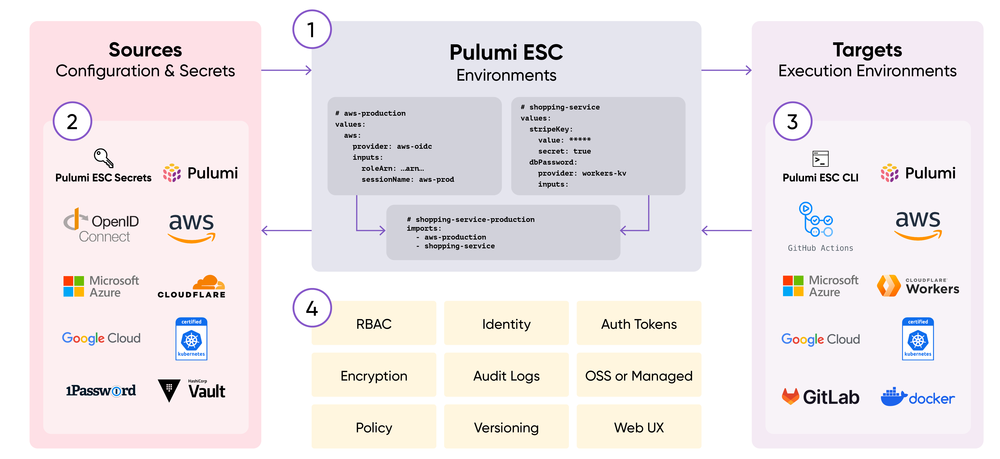

# Chapter 0 - Hello, AWS World!


## Overview

In this chapter, we will develop a simple Pulumi program that creates a single EC2 instance with a basic web server
running on it. Our goal is to become acquainted with the Pulumi CLI, understand the structure of a Pulumi program, and
learn how to create multiple stacks and override default values.

### Modern Infrastructure As Code with Pulumi

Pulumi is an open-source infrastructure-as-code tool for creating, deploying and managing cloud
infrastructure. Pulumi works with traditional infrastructures like VMs, networks, and databases and modern
architectures, including containers, Kubernetes clusters, and serverless functions. Pulumi supports dozens of public,
private, and hybrid cloud service providers.

Pulumi is a multi-language infrastructure as Code tool using imperative languages to create a declarative
infrastructure description.

You have a wide range of programming languages available, and you can use the one you and your team are the most
comfortable with. Currently, (6/2023) Pulumi supports the following languages:

* Node.js (JavaScript / TypeScript)

* Python

* Go

* Java

* .NET (C#, VB, F#)

* YAML

The workshop examples are written in `typescript` and `Go`, but feel free to use the language you are most comfortable
with.

## Instructions

### Step 1 - Configure the AWS CLI

We're going to use the environment variables `AWS_ACCESS_KEY_ID` and `AWS_SECRET_ACCESS_KEY` to configure the AWS CLI.
Simply run the following commands to set them.

```bash
export AWS_ACCESS_KEY_ID=<your-access-key-id>
export AWS_SECRET_ACCESS_KEY=<your-secret-access-key>
```

To verify that the configuration is correct, run the following command.

```bash
aws sts get-caller-identity
```

### Step 2 - Configure the Pulumi CLI

> If you run Pulumi for the first time, you will be asked to log in. Follow the instructions on the screen to
> login. You may need to create an account first, don't worry it is free.

To initialize a new Pulumi project, run `pulumi new` and select from all the available templates the `typescript`. Of
course, you can use any other language you want.

```bash
pulumi new aws-go
```

You will be guided through a wizard to create a new Pulumi project. You can use the following values:

```bash
project name (00-hello-aws-world): 00-hello-aws-world 
project description (A minimal Go Pulumi program):  
Created project '00-hello-aws-world'

Please enter your desired stack name.
To create a stack in an organization, use the format <org-name>/<stack-name> (e.g. `acmecorp/dev`).
stack name (dev): dev 
...
aws:region: The AWS region to deploy into (us-east-1): eu-central-1 
```

The template `aws-go` will create a new Pulumi project with
the [Pulumi AWS provider](https://www.pulumi.com/registry/packages/aws/) already installed. For detailed instructions,
refer to the Pulumi AWS Provider documentation.

### Step 3 - Add a Compute Instance to the Pulumi program

Now, let's begin adding resources to our Pulumi program, starting with a basic compute instance.

For a comprehensive list of available options, consult
the [Pulumi AWS provider](https://www.pulumi.com/registry/packages/aws/) documentation or
utilize your Intellisense for code completion.

To gather more information about the available images and instance types, execute the following 'aws' commands.

```bash
aws ec2 describe-images --output json --region eu-central-1
aws ec2 describe-instance-types --filters "Name=current-generation,Values=true" --output json -region eu-central-1 
```

Please use and `Ubuntu 23.04` image and a `t3.micro` instance type.

This is the user data, you can use to install a simple webserver on the compute instance.

```bash
#cloud-config
package_update: true
packages:
  - python3
write_files:
  - path: /home/ubuntu/index.html
    content: |
      Hello, World from AWS!
runcmd:
  - cd /home/ubuntu
  - nohup python3 -m http.server 8080 &
```

If you got stuck, you can have a look at the [solution](./solutions/00-hello-aws-world/main.go).

### Step 4 - Run Pulumi Up

> Before you can run `pulumi up`, you need to set the AWS credentials `AWS_ACCESS_KEY_ID` and `AWS_SECRET_ACCESS_KEY` as
> environment variables.

```bash
pulumi up
```

This command will show you a preview of all the resources and asks you if you want to deploy them. You can run dedicated
commands to see the preview or to deploy the resources.

```bash
pulumi preview
# or
pulumi up
```

### Step 5 - Get the Public IP of the Compute Instance

To print information about the resources, you need to export the variables in your Pulumi program. In my case, I want to
export the public IP of the compute instance.

```typescript
export const publicIp = simpleVM.publicIpAddress
```

Run `pulumi up` again to see the public IP of the compute instance.

```bash
pulumi up

# omiied for brevity
Outputs:
  + publicIp: "194.182.187.163"
```

Execute the `curl` command to see if the webserver is running.

```bash
curl 194.182.187.163:8080 
curl: (28) Failed to connect to 194.182.187.163 port 8080 after 75006 ms: Couldn't connect to server
```

Bummer, we can't reach the webserver. Why? Because we didn't open the port 80 in the firewall. Let's fix this in the
code!

Add a security group and security group rule to the Pulumi program, and attach the security group to the compute
instance.

After applying the changes, you should be able to reach the webserver.

```bash
➜ curl 194.182.185.5:8080
Hello, World from AWS!
```

### Step 6 - Create a new Stack

Now that we're satisfied with our current stack, we should consider deploying our web server to a production
environment. But what if we wish to deploy with varied outputs or in a different zone?

This is where the concept of 'stacks' becomes invaluable. Stacks allow us to manage multiple deployments of the same
Pulumi program, each with its unique configurations. This flexibility means we can assign distinct configuration values
to each stack and even establish default values for specific configurations.

To proceed, open the `Pulumi.yaml` file and insert the following configuration values.

```yaml
config:
  httpPort: 8080
  aws:region: eu-central-1
  userData: |
    #cloud-config
    package_update: true
    packages:
      - python3
    write_files:
      - path: /home/ubuntu/index.html
        content: |
          Hello, World from AWS!
    runcmd:
      - cd /home/ubuntu
      - nohup python3 -m http.server 8080 &
```

These will serve as our default configuration values. To streamline our Pulumi program, remove the hardcoded values and
replace them with the newly established configuration values.

To create a new stack, execute the following command.

```bash
pulumi stack init prod
```

This will create a new stack called `prod`. You can see all the available stacks with the following command.

```bash
pulumi stack ls
```

Create a new `Pulumi.prod.yaml` file and add the following configuration values.

```yaml
config:
  httpPort: 8081
  aws:region: eu-west-3
  userData: |
    #cloud-config
    package_update: true
    packages:
      - python3
    write_files:
      - path: /home/ubuntu/index.html
        content: |
          Hello, World from AWS Prod!
    runcmd:
      - cd /home/ubuntu
      - nohup python3 -m http.server 8081 &
```

Run `pulumi up` again to deploy the new stack. After a brief moment, your new instance will be deployed. When you
execute
the `curl` command, you should receive a response from the newly deployed web server.

```bash
curl 138.124.210.178:8081
Hello, World from AWS Prod!
```

Verify that you the instances are running in different zones.

```bash
aws ec2 describe-instances --output table --region eu-central-1 --filters "Name=tag:Name,Values=simple-vm"
```

### Step 7 - Pulumi Cloud Console

You might have observed a link to the Pulumi Cloud Console in the Pulumi output. The Pulumi Cloud Console is a web-based
interface designed for managing your Pulumi projects and stacks. It provides a comprehensive view of resources, outputs,
audit logs, and more.

Click on the provided link and sign in using your Pulumi account. Take a moment to explore and familiarize yourself with
its features.

### Step 8 - The new kid in town, Pulumi ESC!

Pulumi ESC (Environments, Secrets, and Configuration) is a cutting-edge solution for managing secrets and configurations
in modern cloud settings. It simplifies the complexities of configuration, ensuring a "secure by default" approach.
Pulumi ESC introduces a new paradigm in configuration as code, allowing teams to consolidate secrets and configurations
into a unified collection termed an 'environment'. This can be utilized across various infrastructure and application
services. While it seamlessly integrates with Pulumi IaC, Pulumi ESC also offers a standalone CLI and API for broader
applications.



1. Pulumi ESC enables you to define environments, which contain collections of secrets and configuration. Each
   environment can be composed from multiple environments.

1. Pulumi ESC supports a variety of configuration and secrets sources, and it has an extensible plugin model that allows
   third-party sources.

1. Pulumi ESC has a rich API that allows for easy integration. Every value in an environment can be accessed from any
   target execution environment.

1. Every environment can be locked down with RBAC, versioned, and audited.

For more information, configuration options and example please visit
the [Pulumi ESC documentation](https://www.pulumi.com/docs/pulumi-cloud/esc/).

Create new Pulumi ESC environment.

```bash
pulumi env init <your-org>/aws
```

And paste this content:

```yaml
values:
  webserver:
    httpPort: 8080
    zone: at-vie-1
    userData: |
      #cloud-config
      package_update: true
      packages:
      - python3
      write_files:
      - path: /home/ubuntu/index.html
        content: |
          Hello, World from AWS!
      runcmd:
      - cd /home/ubuntu
      - nohup python3 -m http.server ${webserver.httpPort} &
  pulumiConfig:
    httpPort: ${webserver.httpPort}
    zone: ${webserver.zone}
    userData: ${webserver.userData}
```

Set up a development environment.

```bash
pulumi env init aws-dev
```

Paste only this content:

```yaml
imports:
- aws
```

Finally, create a prod environment.

```bash
pulumi env init aws-prod
```

With this content:

```yaml
imports:
- aws

values:
  webserver:
    httpPort: 8081
    zone: at-vie-2
    userData: |
      #cloud-config
      package_update: true
      packages:
      - python3
      write_files:
      - path: /home/ubuntu/index.html
        content: |
          Hello, World from AWS Prod!
      runcmd:
      - cd /home/ubuntu
      - nohup python3 -m http.server ${webserver.httpPort} &
  pulumiConfig:
    httpPort: ${webserver.httpPort}
    zone: ${webserver.zone}
    userData: ${webserver.userData}
```

You can now eliminate all the config fields in your Pulumi.*.yaml files and substitute them with the following:

For `dev`:

```yaml
environment:
  imports:
  - aws-dev
```

For `prod`:

```yaml
environment:
  imports:
  - aws-prod
```

Pulumi ESC offers an enhanced method for managing configuration values, making it easier to share them with your team or
across different stacks. While the earlier config approach remains supported, you also have the flexibility to combine
both methods.

### Step 9 - Destroy the stack

To destroy the stack, run the following command.

```bash
pulumi destroy
pulumi stack rm <stack-name>
```

And confirm the destruction with `yes`.

To switch between stacks, you can use the following command.

```bash
pulumi stack select <stack-name>
```

## Stretch Goals

- Can you create a new stack with a different instance type?
- Can you enable ssh access to the compute instance with your local ssh key?

## Learn more

- [Pulumi](https://www.pulumi.com/)
- [Pulumi AWS provider](https://www.pulumi.com/registry/packages/aws/)
- [Pulumi ESC](https://www.pulumi.com/docs/pulumi-cloud/esc/)
